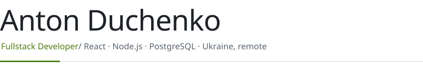
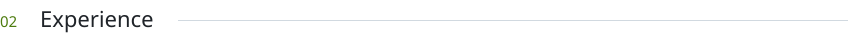
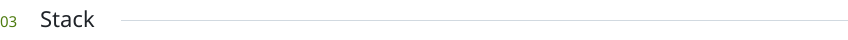
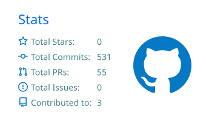
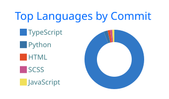

  <picture><source media="(prefers-color-scheme: dark)" srcset="./assets/header-dark.svg" /></picture>

  <a href="https://antonduchenko.github.io/portfolio/"><b>Portfolio ↗&#xFE0E;</b></a>&nbsp;&nbsp;&nbsp;
  <a href="https://www.linkedin.com/in/anton-duchenko-471369252/">LinkedIn ↗&#xFE0E;</a>&nbsp;&nbsp;&nbsp;
  <a href="https://t.me/Anton_Duchenko">Telegram ↗&#xFE0E;</a>&nbsp;&nbsp;&nbsp;
  <a href="mailto:anton.duchenko2@gmail.com">Email ↗&#xFE0E;</a>

<picture><source media="(prefers-color-scheme: dark)" srcset="./assets/section-01-dark.svg" /></picture>

Fullstack developer with **2+ years** of experience building scalable web applications end to end: React interfaces,
APIs, database design and integrations. Currently at **Binary Studio**. I work closely with designers, product managers
and QA engineers. English — Upper-Intermediate.

<picture><source media="(prefers-color-scheme: dark)" srcset="./assets/section-02-dark.svg" /></picture>

**Binary Studio** — Fullstack Developer &nbsp;`08/2025 – now`

- −30% page load time via Drizzle ORM query optimization and caching
- TanStack Table/Router admin panel for 10,000+ inventory entities
- Design system on TailwindCSS + shadcn/ui, Sanity CMS integration

**Nitrix Soft** — Fullstack Developer &nbsp;`03/2025 – 08/2025`

- OpenAI + Azure Speech in a language-learning platform: +45% session time, +25% retention
- −60% query execution time on 1M+ record datasets through indexing

**Maxopen Studio** — React Developer &nbsp;`01/2024 – 03/2025`

- TON Connect: 500+ secure daily payments with 99.9% uptime
- P2P marketplace on TON: 200+ active users in the first month
- −20% load time through API optimization → +15% conversion rate

<picture><source media="(prefers-color-scheme: dark)" srcset="./assets/section-03-dark.svg" /></picture>

  <picture><source media="(prefers-color-scheme: dark)" srcset="https://cdn.simpleicons.org/typescript/c9d1d9" /></picture>&nbsp;&nbsp;
  <picture><source media="(prefers-color-scheme: dark)" srcset="https://cdn.simpleicons.org/javascript/c9d1d9" /></picture>&nbsp;&nbsp;
  <picture><source media="(prefers-color-scheme: dark)" srcset="https://cdn.simpleicons.org/react/c9d1d9" /></picture>&nbsp;&nbsp;
  <picture><source media="(prefers-color-scheme: dark)" srcset="https://cdn.simpleicons.org/tanstack/c9d1d9" /></picture>&nbsp;&nbsp;
  <picture><source media="(prefers-color-scheme: dark)" srcset="https://cdn.simpleicons.org/astro/c9d1d9" /></picture>&nbsp;&nbsp;
  <picture><source media="(prefers-color-scheme: dark)" srcset="https://cdn.simpleicons.org/redux/c9d1d9" /></picture>&nbsp;&nbsp;
  <picture><source media="(prefers-color-scheme: dark)" srcset="https://cdn.simpleicons.org/tailwindcss/c9d1d9" /></picture>&nbsp;&nbsp;
  <picture><source media="(prefers-color-scheme: dark)" srcset="https://cdn.simpleicons.org/shadcnui/c9d1d9" /></picture>&nbsp;&nbsp;
  <picture><source media="(prefers-color-scheme: dark)" srcset="https://cdn.simpleicons.org/sass/c9d1d9" /></picture>&nbsp;&nbsp;
  <picture><source media="(prefers-color-scheme: dark)" srcset="https://cdn.simpleicons.org/nodedotjs/c9d1d9" /></picture>&nbsp;&nbsp;
  <picture><source media="(prefers-color-scheme: dark)" srcset="https://cdn.simpleicons.org/nestjs/c9d1d9" /></picture>&nbsp;&nbsp;
  <picture><source media="(prefers-color-scheme: dark)" srcset="https://cdn.simpleicons.org/express/c9d1d9" /></picture>&nbsp;&nbsp;
  <picture><source media="(prefers-color-scheme: dark)" srcset="https://cdn.simpleicons.org/trpc/c9d1d9" /></picture>&nbsp;&nbsp;
  <picture><source media="(prefers-color-scheme: dark)" srcset="https://cdn.simpleicons.org/graphql/c9d1d9" /></picture>&nbsp;&nbsp;
  <picture><source media="(prefers-color-scheme: dark)" srcset="https://cdn.simpleicons.org/postgresql/c9d1d9" /></picture>&nbsp;&nbsp;
  <picture><source media="(prefers-color-scheme: dark)" srcset="https://cdn.simpleicons.org/mysql/c9d1d9" /></picture>&nbsp;&nbsp;
  <picture><source media="(prefers-color-scheme: dark)" srcset="https://cdn.simpleicons.org/drizzle/c9d1d9" /></picture>&nbsp;&nbsp;
  <picture><source media="(prefers-color-scheme: dark)" srcset="https://cdn.simpleicons.org/sanity/c9d1d9" /></picture>&nbsp;&nbsp;
  <picture><source media="(prefers-color-scheme: dark)" srcset="https://cdn.simpleicons.org/ton/c9d1d9" /></picture>&nbsp;&nbsp;
  <picture><source media="(prefers-color-scheme: dark)" srcset="https://cdn.simpleicons.org/git/c9d1d9" /></picture>&nbsp;&nbsp;

TypeScript · JavaScript · React · TanStack Start/Router/Table · Astro · Redux · Tailwind · shadcn/ui · Sass · Node.js · Nest.js · Express · tRPC/oRPC · GraphQL · REST · PostgreSQL · MySQL · Drizzle ORM · Sanity CMS · TON Connect · OpenAI · Azure AI

<picture><source media="(prefers-color-scheme: dark)" srcset="./assets/section-04-dark.svg" /></picture>

  
  

<picture><source media="(prefers-color-scheme: dark)" srcset="./assets/section-05-dark.svg" /></picture>

**Mate Academy** — Fullstack Developer &nbsp;`2022 – 2023` 
**Kherson State Maritime Academy** — Electro-technical Officer, Master's &nbsp;`2013 – 2019`
